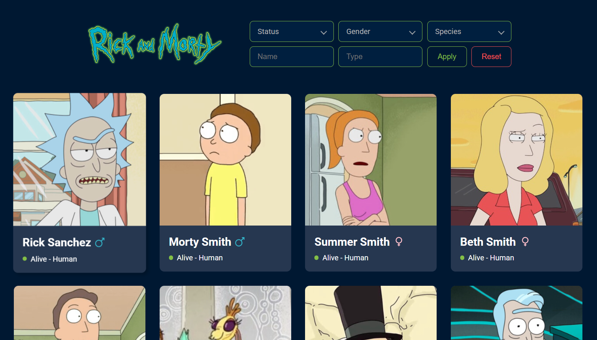
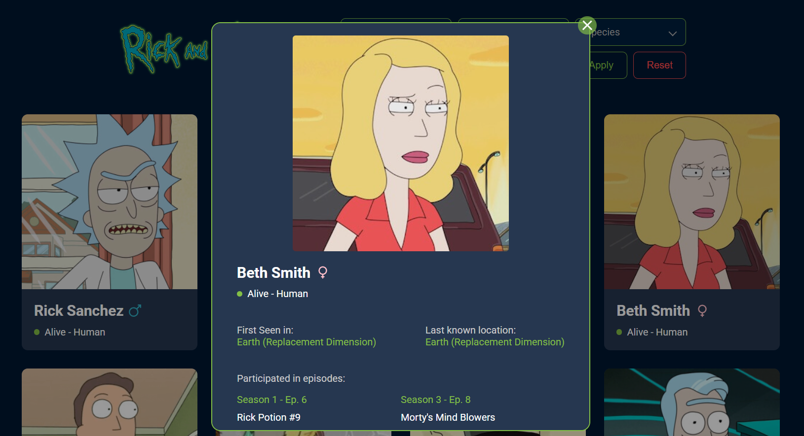
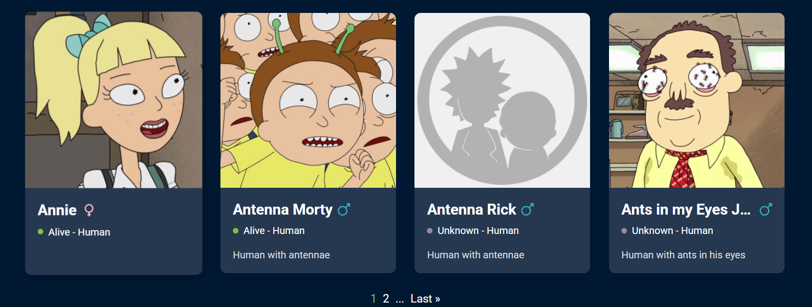
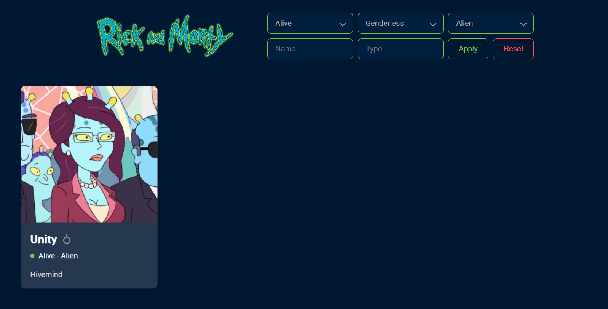
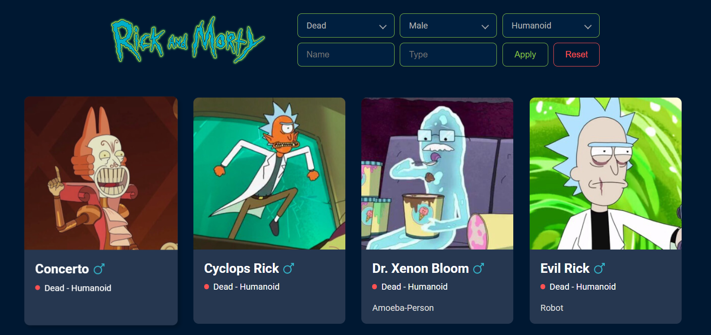

# Rick and Morty Characters React

[Посмотреть на Netlify](https://virtanen-rickandmorty.netlify.app/)

## 📚 Описание

Это одностраничное приложение (SPA), разработанное с использованием React, которое отображает персонажей из вселенной «Рик и Морти». Данные получаются из открытого [Rick and Morty API](https://rickandmortyapi.com/). Приложение позволяет пользователям просматривать список персонажей с возможностью фильтрации.

## 🚀 Функциональность

- **Список персонажей**: Отображение карточек персонажей с их изображениями и именами.
- **Фильтрация**: Возможность фильтрации персонажей по статусу (жив, мёртв, неизвестно), полу и виду.
- **Пагинация**: Разбиение списка персонажей на страницы для удобного просмотра.
- **Адаптивный дизайн**: Интерфейс, оптимизированный для различных устройств.

## 🖼️ Скриншоты

### Главная с фильтрами, поиском и списком карточек

### Отдельная карточка персонажа

### Пагинация внизу списка карточек

### Применение фильтров к списку карточек

## 🛠️ Используемые технологии

- **React**: Основной фреймворк для создания пользовательского интерфейса.
- **React Router**: Для управления маршрутизацией внутри приложения.
- **Axios**: Для выполнения HTTP-запросов к API.
- **CSS Modules**: Для стилизации компонентов.

## 🚀 Установка и запуск

1. Клонируйте репозиторий:
   git clone https://github.com/HelenVirtanen/rick-morty-characters-react.git
2. Перейдите в папку проекта:
   cd rick-morty-characters-react
3. Установите зависимости:
   npm i
4. Запустите приложение:
   npm run start

Приложение будет доступно по адресу http://localhost:3000
